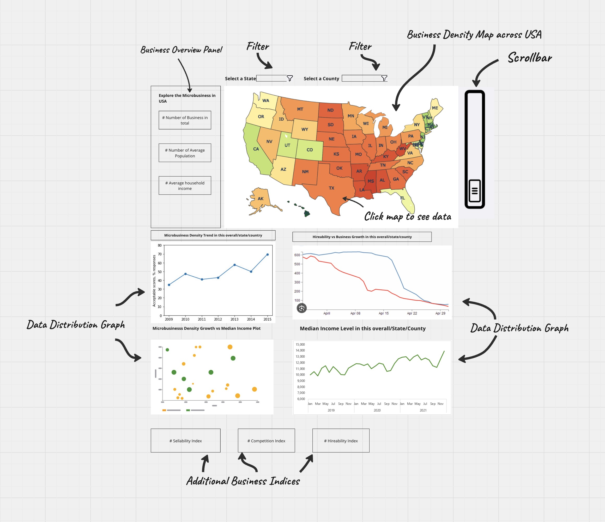

# Smart Microbusiness Finder Proposal

## Section 1: Motivation and Purpose

Launching a microbusiness can be a daunting process. It requires a large financial and time investment, and carries a lot of inherent risk. And even with an excellent business model, many intangible factors can cause a would-be successful venture to fail. These include:
- Was the business launched at a good time financially?
- Is there already a saturation of microbusinesses at the location of interest?
- Is there a market for the product? And is there skilled labor available to hire from?

The small business distribution dashboard  -  or SMBFinder - aims to address these challenges by providing a visualization of the distribution of microbusinesses across the United States.

The app will provide the user with a geographical view of where these businesses are the most densely situated, allow the user to hone in on an area of interest to view historical trends such as business growth over time, and will deliver key business insights on the demographics of the area. With the help of SMBFinder, a new entrepreneur will be able to determine where and when to launch their business, and have more confidence that their idea will be a success.

## Section 2: Description of the data

In this project, we will be visualizing microbusiness activity across United States counties. The dataset contains information about microbusiness density (the number of microbusinesses per 100 adults) and related demographic and economic indicators that could help explain variations in microbusiness activity. 

The core training dataset consists of county-level observations over time, with each row representing a county-month combination. Key variables include:
- Geographic identifiers (cfips, county_name, state_name)
- Temporal information (first_day_of_month)
- Target metrics (microbusiness_density, active microbusiness counts)

This is complemented by census data containing important socioeconomic indicators that we hypothesize could influence microbusiness activity:
- Digital infrastructure (pct_bb - broadband access percentage)
- Human capital (pct_college - population with college degrees)
- Economic characteristics (median_hh_inc - median household income)
- Workforce composition (pct_it_workers, pct_foreign_born)

Some additional data to acquire:
- County / State shapes (geojsons)
- Population (state_population, county_population)

We plan define key metrics for our audience (Can be changed later on):
- Year_over_year_growth (or MoM): The percentage change in microbusiness density compared to the same month in the previous year / previous months
- state_rank: Each county's relative position within its state based on microbusiness density
- business_growth_score: Recommendations if county / state is good to grow a microbusiness
- Market_opprtunity_score: microbusiness count / population_size (can introduce income, college level, broadband access weights, can be a linear model)
- Hireability (# degree holders in county  / county population) / (US average)
- Competition (# businesses / county population)
- Growth (rate of business growth over time)
- Sellability (median income per household)

This dataset is originally designed for model development, which is split into train and test. We will be using the train dataset which has 122265 unique observations. The training dataset contains approximately 3,000 counties tracked over multiple months, resulting in tens of thousands of observations. Each observation includes the core variables mentioned above, plus the supplementary census data variables. 

One limitation of the current dataset is the lack of industry-specific information about the microbusinesses. Having data about the types of microbusinesses (e.g., retail, services, technology) would provide valuable insights for more targeted recommendations for the user. 

## Research questions and usage scenarios

Mina is an entrepreneur exploring potential locations for her new microbusiness in the U.S. She wants to use data to evaluate different regions and make a well-informed decision about where to establish her venture.

When Mina logs into SMBFinder, she sees an interactive heatmap of the U.S., where areas with higher microbusiness density stand out. To refine her search, she uses the dropdown filter to select a state and county, updating the graphs below to display region-specific trends. The dashboard provides key business metrics such as microbusiness density trends, hireability versus business growth, and median income over time, allowing her to analyze market conditions.

Additionally, Mina explores data distribution graphs that compare microbusiness density growth with median income and other economic indicators. She also reviews additional business indices, including sellability and competition, which become available after selecting a state or county. These insights help her assess the competitiveness of different locations.

By examining these insights, Mina identifies counties with high business activity but low competition, signaling potential opportunities. Based on this data, she shortlists a few promising counties and plans to conduct further market research. These insights help her develop a strategic plan for launching her business in a location that maximizes growth potential while minimizing risks.

## Section 4: [Dashboard Design](https://miro.com/app/board/uXjVIfvLXOI=/?share_link_id=140634678618)

The app provides an interactive dashboard to help entrepreneurs explore microbusiness trends across the USA. The landing page shows a business density map, where users can click on a state to view detailed insights. On the left side, the Business Overview Panel shows key summary statistics. At the top of the map, users can filter data by state and county. 

Below the map, data distribution graphs show the trends in various metrics. At the bottom of the dashboard, users can access additional business indices such as the Sellability Index, Competition Index, and Hireability Index.

Users can scroll down to explore more data distribution graphs, either filtered by selection or showing overall trends.

## Definitions:
**Microbusiness**: A business that has an online presence with less than 10 employees. 

## Data sources:
- [Kaggle datalink: GoDaddy - Microbusiness Density Forecasting](https://www.kaggle.com/competitions/godaddy-microbusiness-density-forecasting/overview)